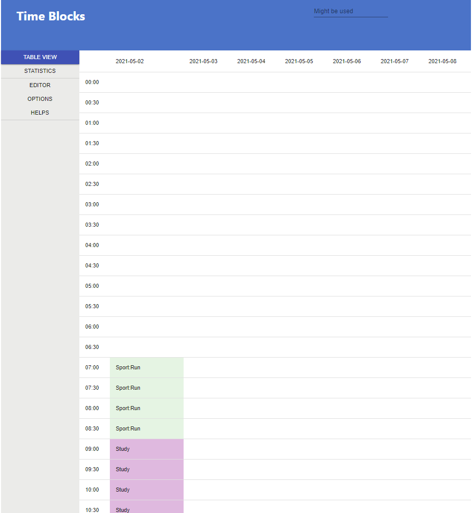

# timeblock

A web application to record your life in a text editor way

---------------------------------------------------

## Platform

Currently, only linux is supported

---------------------------------------------------

## Screenshot


---------------------------------------------------

## Based on:
### Front end
* React
* Redux
* Hooks

### Back end
* flask
* antlr 4

------------------------------------------------------

## Before build

1. install [nodejs and npm](https://nodejs.org/zh-cn/)
2. install [python3](https://www.python.org/) and [pip3](https://pypi.org/)
3. download [antlr 4](https://www.antlr.org/) to directory `bin`
```
timeblock/
   |
   +---bin/
        |
        +---antlr-4.9.2-complete.jar
```
4. run `pip3 install flask watchdog antlr4-python3-runtime`

## Build
4. run `make build`

## Deploy
5. run `make deploy`

## Run
6. run `python3 -m timeblock`
7. Then you can visit `http://127.0.0.1:5000`

